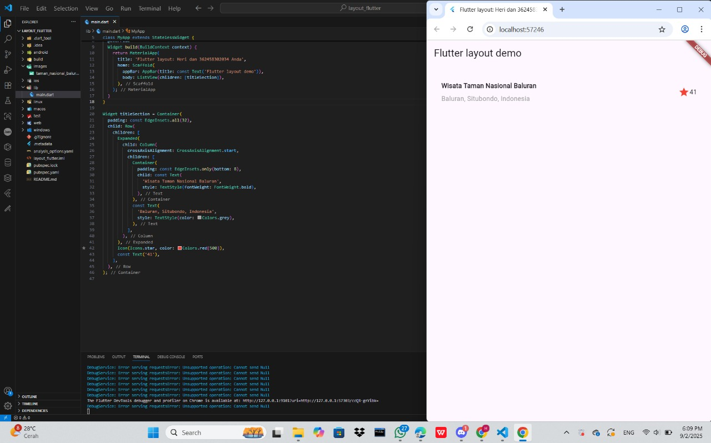
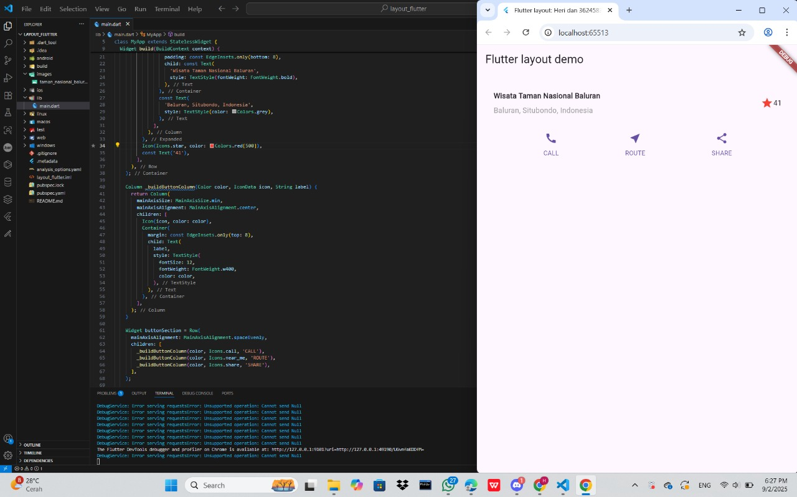
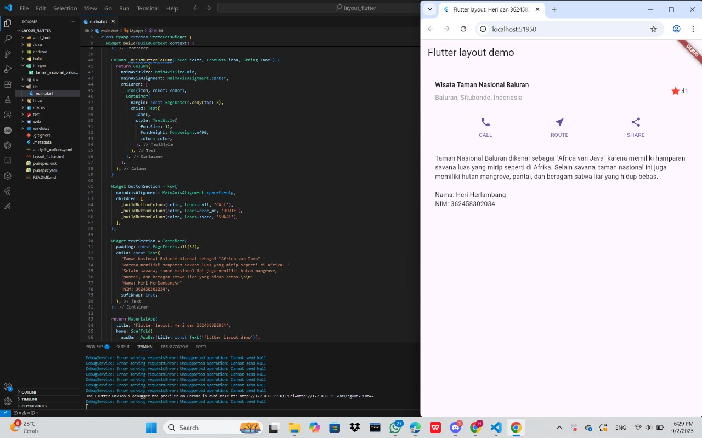
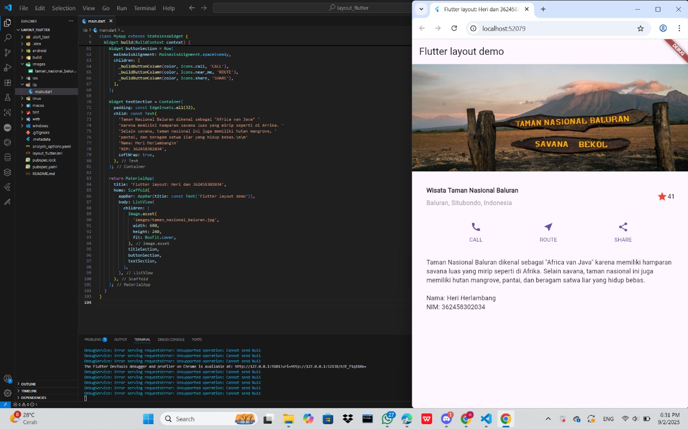

# layout_flutter

A new Flutter project.

## Getting Started

This project is a starting point for a Flutter application.

A few resources to get you started if this is your first Flutter project:

- [Lab: Write your first Flutter app](https://docs.flutter.dev/get-started/codelab)
- [Cookbook: Useful Flutter samples](https://docs.flutter.dev/cookbook)

For help getting started with Flutter development, view the
[online documentation](https://docs.flutter.dev/), which offers tutorials,
samples, guidance on mobile development, and a full API reference.

# Layout & button (Pertemuan 3)
- Nama: Heri Herlambang
- Nim : 362458302034
- kelas: 2D TRPL

# Dokumentasi Praktikum 1: Membuat Layout Di Flutter

- buat project baru dengan menekan cntrl+shif+p lalu buat project baru dengan nama layouta_flutter
- nah pada bagian file main.dart edit pada bagian title menjadi 'Flutter layout: Heri dan 362458302034'
- lalu kita analisis layout yang akan kita buat
- stelah itu buat title sectionnya dan masuk kan kode berikut :
 Widget titleSection = Container(
      padding: const EdgeInsets.all(32),
      child: Row(
        children: [
          Expanded(
            child: Column(
              crossAxisAlignment: CrossAxisAlignment.start,
              children: [
                Container(
                  padding: const EdgeInsets.only(bottom: 8),
                  child: const Text(
                    'Wisata Taman Nasional Baluran',
                    style: TextStyle(fontWeight: FontWeight.bold),
                  ),
                ),
                const Text(
                  'Baluran, Situbondo, Indonesia',
                  style: TextStyle(color: Colors.grey),
                ),
              ],
            ),
          ),
          Icon(Icons.star, color: Colors.red[500]),
          const Text('41'),
        ],
      ),
    );
- setelah itu jalankan flutter
- setelah dijalankan akan menampilkan judul, lokasi, ikon bintang, dan angka di samping bintang

# Dokumentasi Praktikum 2: Implementasi button row

- setelah step pembuatan widget kita masuk ke step pembuatan method dan juga buttonnya
- kita buat method _buildButtonColumn dan begini untuk kodenya ini :
    Column _buildButtonColumn(Color color, IconData icon, String label) {
      return Column(
        mainAxisSize: MainAxisSize.min,
        mainAxisAlignment: MainAxisAlignment.center,
        children: [
          Icon(icon, color: color),
          Container(
            margin: const EdgeInsets.only(top: 8),
            child: Text(
              label,
              style: TextStyle(
                fontSize: 12,
                fontWeight: FontWeight.w400,
                color: color,
              ),
            ),
          ),
        ],
      );
    }
- nah untuk kode yang diatas itu di letakkan di dalam MyApp class
-nah kode diatas itu digunakan untuk membuat tombol kecil yang berisi icon datas dan teks dibawahnya
- setelah itu kita membuat buttonnya dengan kode : 
    Widget buttonSection = Row(
      mainAxisAlignment: MainAxisAlignment.spaceEvenly,
      children: [
        _buildButtonColumn(color, Icons.call, 'CALL'),
        _buildButtonColumn(color, Icons.near_me, 'ROUTE'),
        _buildButtonColumn(color, Icons.share, 'SHARE'),
      ],
    );
- nah kode yang di atas ini digunakan untuk mengsejajarkan ke samping dengan row, jadi ada tiga tombol rata yang sejajar
- jadi pada saat flutter di jalankan maka di bawah judul yang sudah kita buat tadi akan ketambahan 3 icon dibawah dudul

# Dokumentasi Praktikum 3: Implementasi text section

- nah setelah kita mengimplementasikan icon tidak cocok jika tidak ada deskripsi singkatnya jadi disini kita akan membuat text section
- pertama tama kita tentukan bagian teks sebagai variabelnya setelah itu kita masukkan teksnya ke dalam Container dan tambahkan padding di sepanjang setiap tepinya lalu masukan kode berikut dibawah deklarasi dari button :
    Widget textSection = Container(
      padding: const EdgeInsets.all(32),
      child: const Text(
        'Taman Nasional Baluran dikenal sebagai "Africa van Java" '
        'karena memiliki hamparan savana luas yang mirip seperti di Afrika. '
        'Selain savana, taman nasional ini juga memiliki hutan mangrove, '
        'pantai, dan beragam satwa liar yang hidup bebas.\n\n'
        'Nama: Heri Herlambang\n'
        'NIM: 362458302034',
        softWrap: true,
      ),
    );
- nah ini merupakan kode untuk deskripsi dari wisata baluran yang dimasukkan ke dalam kontainer
-nag untuk kode softWrap: true digunnakan untuk membuat teks otomatis ke baris berikutnya jika teks kepanjangan 

# Dokumentasi Praktikum 4: Implementasi image section

- nah semua step yang sudah kita buat kita akan menambahkan gambar di dalam layout yang kita buat
- pertama tama kita siapkan gambar wisata yang akan digunakan karena saya menggunakan taman nasional jadi saya menggunakan gambar dari wisata taman nasional baluran 
- setelah itu masukan gambar ke file yang bersangkutan dan buat folder bernama images lalu masukan ke dalam kode ini : 
    return MaterialApp(
      title: 'Flutter layout: Heri dan 362458302034',
      home: Scaffold(
        appBar: AppBar(title: const Text('Flutter layout demo')),
        body: ListView(
          children: [
            Image.asset(
              'images/taman_nasional_baluran.jpg',
              width: 600,
              height: 240,
              fit: BoxFit.cover,
            ),
            titleSection,
            buttonSection,
            textSection,
          ],
        ),
      ),
    );
  }
}
- nah untuk gambarnya masukan nama gambarnya di image.asset
- setelah semua step telah dilakukan maka urut semua bagiannya yang dimana awal adalah gambar, lalu judul, lalu icon, lalu teks
- layout dibuat lalu kita jalankan flutter lalu akan ditampilkan tempat wisata dan sdeskripsinya yang telah kita buat